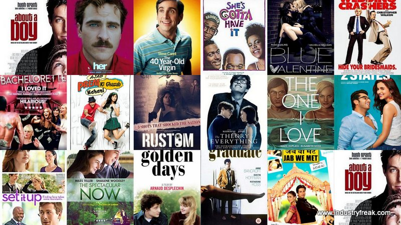

# Movie Recommendation using Cosine Similarity




The purpose of a recommendation system basically is to search for content that would be interesting to an individual. Moreover, it involves a number of factors to create personalised lists of useful and interesting content specific to each user/individual. Recommendation systems are Artificial Intelligence based algorithms that skim through all possible options and create a customized list of items that are interesting and relevant to an individual. These results are based on their profile, search/browsing history, what other people with similar traits/demographics are watching, and how likely are you to watch those movies. This is achieved through predictive modeling and heuristics with the data available.

### All about the project
It is a simple Movie Recommendation application that suggests similiar movies based on the choice. The script required basic exploratory data analysis, text vectoriztion, TFIDF, and simple cosine Similarity algorithm. The Strem lit app is hosted on Heroku platform.

* [Click here to run it live on server](https://movie-recommendation12.herokuapp.com/)

A web server will open similar to the picture bellow


# Dataset has been used:

* [Dataset link](https://www.kaggle.com/tmdb/tmdb-movie-metadata?select=tmdb_5000_movies.csv)

# How to run?
Clone the repository
```
https://github.com/Sagor-Saha/Movie_recommendation_using_cosine_similarity.git

```
Install the libraries required
```
pip install -r requirements.txt
```

run this file to generate the models

```
Movie Recommender System Data Analysis.ipynb
```

Now run,
```
streamlit run app.py

```
## 🔗 Links
[](https://sagorsaha.tech/)
[](https://www.linkedin.com/in/sagor-saha-047001111/)
